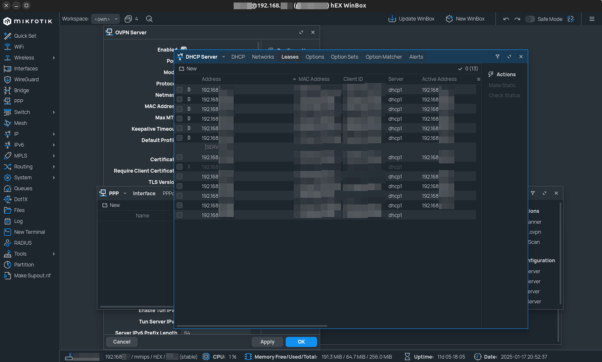

# 🏠 Homelab

---
## 🗒️ General Notes

This repository serves as the primary documentation hub for my **Homelab**.

**Homelab** is a personal project — an on-premises private infrastructure that hosts the networks and machines I use for experimenting with new technologies or providing private, self-hosted services. This approach ensures that data is stored on proprietary devices, offering a secure testbed for learning before applying similar principles in the field.

In this repository: [https://github.com/CSpyridakis/notes](https://github.com/CSpyridakis/notes), you can find general notes on various technologies. Some of these notes pertain to the creation and maintenance of this **Homelab**.

For quick access and an at-a-glance overview of the **Homelab**'s status, I use the [homepage dashboard](https://github.com/gethomepage/homepage). My configuration for this dashboard is available in the following repository: [https://github.com/CSpyridakis/homepage](https://github.com/CSpyridakis/homepage).

Regarding my Desktop Workstation, which is one of the devices in this network, I use an Ubuntu Desktop system as my daily driver. This is my main device for development. One of the most important aspects is the applications I use and their configurations. Therefore, my personal collection of dotfiles is also available here: [https://github.com/CSpyridakis/dotfiles](https://github.com/CSpyridakis/dotfiles).

---

## 🖧 Network Diagram
The core elements of my **Homelab**  are showcased in the following diagram. These elements will be described later.

---

## 🌐 Routers

In my setup, three different routers are used, each with its own subnet and purpose:

A. The first is my `ISP modem/router`, which provides network connectivity to all the apartments in my building.

B. The second is my `Home network` router, which provides internet access to general home devices such as smart TVs, IP cameras, and sensors. It also hosts the guest network.

C. Finally, there is my **Homelab** network router, which connects all the devices related to this project.

Both my Home and **Homelab** routers are MikroTik routers, which means they can be strictly configured based on my needs.

As can be easily inferred, my **Homelab** exists behind a NAT. However, for various reasons, I need to access my **Homelab** from anywhere in the world. One of my design rules, however, is to avoid exposing any services directly to the internet.

To achieve this, I use one of the `VPN Services` along with the `IP Cloud` feature provided by `MikroTik` to create a VPN tunnel for secure access to my network. To complete the setup, the proper ports must also be forwarded through the other two routers.

Below is a screenshot from `Winbox` that provides a general understanding of the **Homelab** network.

## **Homelab** devices
Having explained the interconnection of devices, this section will describe the actual devices used and their purpose.

### 🖥️ 1. Main Server

#### Proxmox
In my main processing device, I decided to run a [Τype 1](https://aws.amazon.com/compare/the-difference-between-type-1-and-type-2-hypervisors/) [Hypervisor](https://en.wikipedia.org/wiki/Hypervisor) in order to easily spawn Virtual Machines (VMs) based on my needs.

For this purpose, [Proxmox VE](https://www.proxmox.com/en/) was selected. 

To leverage the Nvidia GPU that my main server accommodates, actions were also taken to passthrough the GPU to the host.

##### 🖥️🖥️ A. Virtual Machines
Using Proxmox, different VMs can be easily created, and services can be deployed on them to run experiments that follow [IaaS](https://en.wikipedia.org/wiki/Infrastructure_as_a_service) principles before continuing development or production activities in other infrastructures, whether private or public.

##### 🐳 B. Portainer
One of my needs is related to container deployment. [Portainer](https://www.portainer.io/) is a widely used container management software; for this reason, Portainer is also deployed as an LXC and provides container management services when I need to test individual containers that are not part of a Kubernetes cluster or run services required in my network.

The docker-compose files that are used to create my stacks are available here: [https://github.com/CSpyridakis/dockerfiles](https://github.com/CSpyridakis/dockerfiles).

##### Nginx Proxy manager
Moreover, Nginx Proxy Manager is one of the containers that continuously runs on my main server. This way, I provide reverse proxy mechanism to my other services.

One option would be to define the hostnames of the services statically in the `/etc/hosts` file of my devices or in my router. However, this would require syncing this information between different machines and networks (if I decide to recreate a similar project elsewhere). For this reason, I chose to create a domain using [Duck DNS](https://www.duckdns.org/), which will have an `A record` that resolves to a private IP and can be updated once to run from everywhere. Finally, the option to create certificates using [Let's encrypt](https://letsencrypt.org/), which Nginx Proxy Manager provides, was used to add TLS for these services.

##### C. Services
###### 🤖 C.1 [Ollama](https://ollama.com/)
Finally, on my Proxmox node, I run some services directly. These services are not part of a VM or container and are deployed directly on the host. The reason for this is ease of use, and because they are not meant to be uninstalled from the system. A main example is the Ollama server, which I use to provide LLM support and experiment with them.

During my prompt experimentation, some modelfiles were created, which are available here: [https://github.com/CSpyridakis/modelfiles](https://github.com/CSpyridakis/modelfiles).

--- 

### 🖴 2. NAS 
[TrueNAS]()

#### ⚙️ Services
Among others like ([Jellyfin](), [Photoprism](), [Nextcloud](https://nextcloud.com/), etc, which are used )

##### 1. [Gitea](https://about.gitea.com/)
##### 2. [Distribution](https://distribution.github.io/distribution/)
##### 3. [Pi-hole](https://pi-hole.net/)

--- 

### 3. Intel NUC

### 4. Raspberry PI

### 5. Jetson Nano

--- 
