# 🏠 Homelab

Technologies used:
 
<a href="https://www.portainer.io/">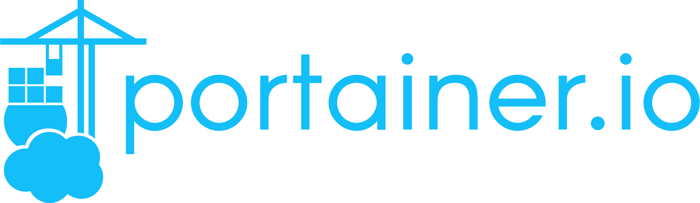</a> 
<a href="https://www.docker.com/">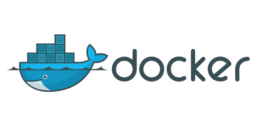</a> 
 
 
 

 
 
<a href="https://docs.ansible.com/">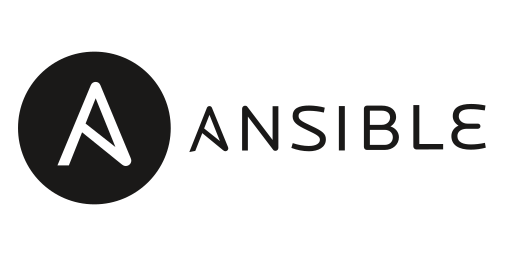</a> 
 
 
 

---

## 🗒️ General Notes

This repository serves as the primary documentation hub for my **Homelab**.

**Homelab** is a personal project — an on-premises private infrastructure that hosts the networks and machines I use for experimenting with new technologies or providing private, self-hosted services. This approach ensures that data is stored on proprietary devices, offering a secure testbed for learning before applying similar principles in the field.

In this repository: [https://github.com/CSpyridakis/notes](https://github.com/CSpyridakis/notes), you can find general notes on various technologies. Some of these notes pertain to the creation and maintenance of this **Homelab**.

For quick access and an at-a-glance overview of the **Homelab**'s status, I use the [homepage dashboard](https://github.com/gethomepage/homepage). My configuration for this dashboard is available in the following repository: [https://github.com/CSpyridakis/homepage](https://github.com/CSpyridakis/homepage).

Regarding my Desktop Workstation, which is one of the devices in this network, I use an Ubuntu Desktop system as my daily driver. This is my main device for development. One of the most important aspects is the applications I use and their configurations. Therefore, my personal collection of dotfiles is also available here: [https://github.com/CSpyridakis/dotfiles](https://github.com/CSpyridakis/dotfiles).

---

## 🖧 Network Diagram
The core elements of my **Homelab**  are showcased in the following diagram. These elements will be described later.

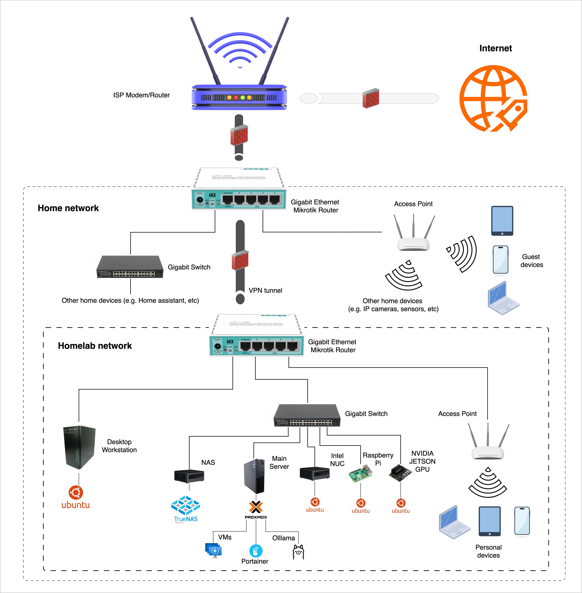

---

## 🌐 Routers

In my setup, three different routers are used, each with its own subnet and purpose:

A. The first is my `ISP modem/router`, which provides network connectivity to all the apartments in my building.

B. The second is my `Home network` router, which provides internet access to general home devices such as smart TVs, IP cameras, and sensors. It also hosts the guest network.

C. Finally, there is my **Homelab** network router, which connects all the devices related to this project.

Both my Home and **Homelab** routers are MikroTik routers, which means they can be strictly configured based on my needs.

As can be easily inferred, my **Homelab** exists behind a NAT. However, for various reasons, I need to access my **Homelab** from anywhere in the world. One of my design rules, however, is to avoid exposing any services directly to the internet.

To achieve this, I use one of the `VPN Services` along with the `IP Cloud` feature provided by `MikroTik` to create a VPN tunnel for secure access to my network. To complete the setup, the proper ports must also be forwarded through the other two routers.

Below is a screenshot from `Winbox` that provides a general understanding of the **Homelab** network.

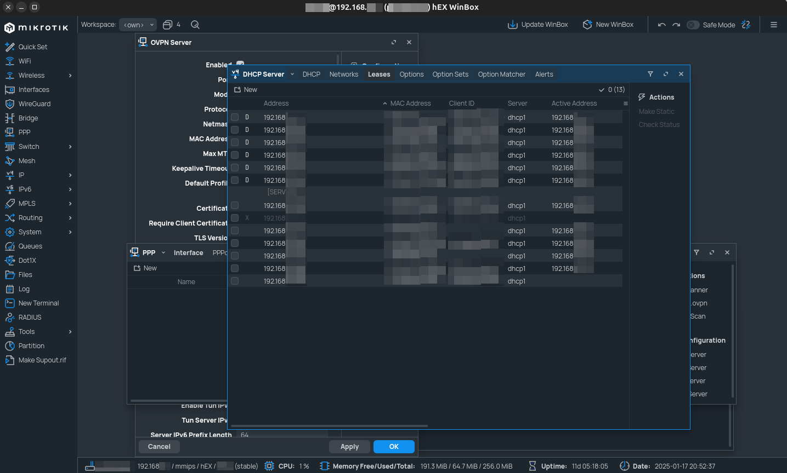

## Access Points
In my setup, I also have two different access points: one for the internal network and another for the external network. Both devices run [OpenWrt](https://openwrt.org/) to allow more granular configuration.

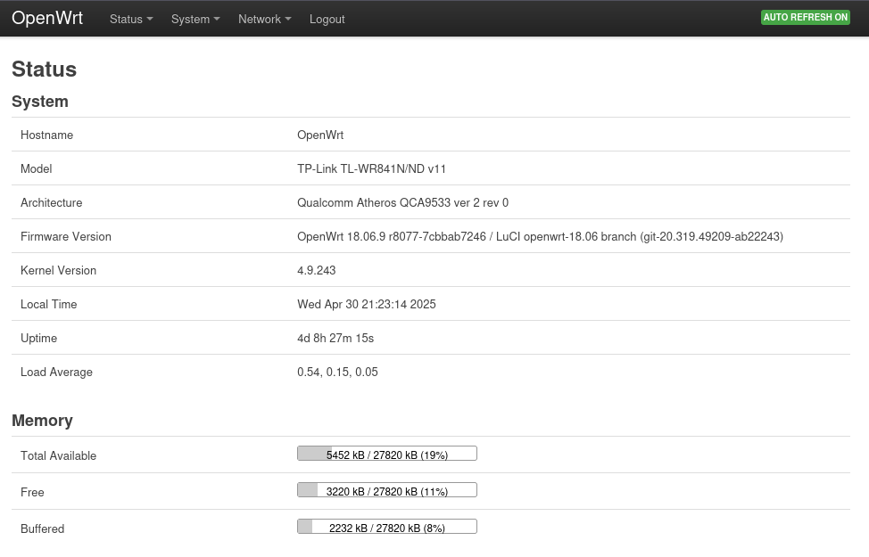

## **Homelab** devices
Having explained the interconnection of devices, this section will describe the actual devices used and their purpose.

### 🖥️ 1. Main Server

#### Proxmox
In my main processing device, I decided to run a [Τype 1](https://aws.amazon.com/compare/the-difference-between-type-1-and-type-2-hypervisors/) [Hypervisor](https://en.wikipedia.org/wiki/Hypervisor) in order to easily spawn Virtual Machines (VMs) based on my needs.

For this purpose, [Proxmox VE](https://www.proxmox.com/en/) was selected. 

To leverage the Nvidia GPU that my main server accommodates, actions were also taken to passthrough the GPU to the host.

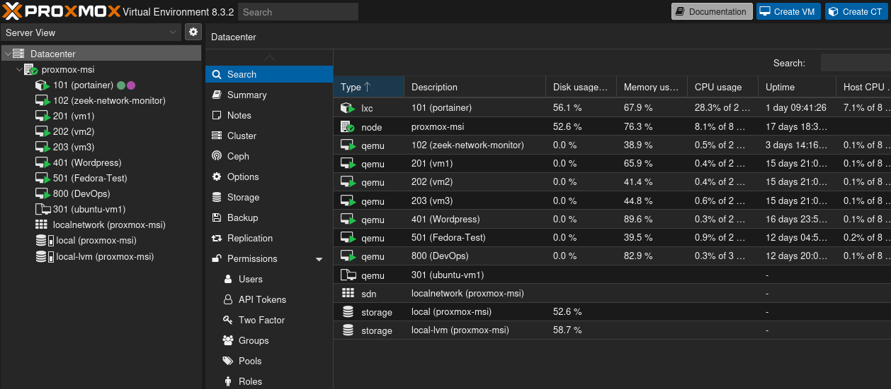

##### 🖥️🖥️ A. Virtual Machines
Using Proxmox, different VMs can be easily created, and services can be deployed on them to run experiments that follow [IaaS](https://en.wikipedia.org/wiki/Infrastructure_as_a_service) principles before continuing development or production activities in other infrastructures, whether private or public. Some of these VMs are behind a firewall, to be more specific a virtual pfsense deployed as a VM in the Proxmox server, to be able to communicate in their internal subnets.

##### 🐳 B. Portainer
One of my needs is related to container deployment. [Portainer](https://www.portainer.io/) is a widely used container management software; for this reason, Portainer is also deployed as an LXC and provides container management services when I need to test individual containers that are not part of a Kubernetes cluster or run services required in my network.

The docker-compose files that are used to create my stacks are available here: [https://github.com/CSpyridakis/dockerfiles](https://github.com/CSpyridakis/dockerfiles).

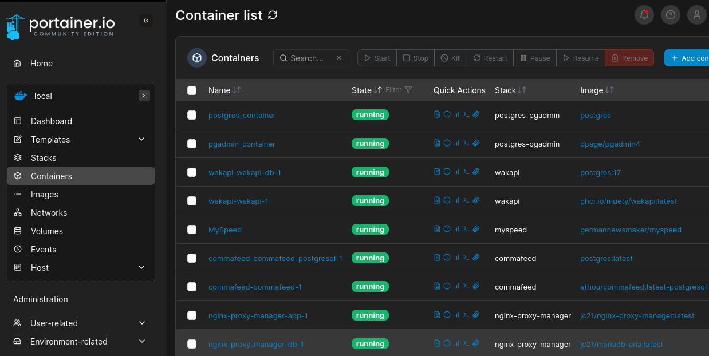

##### Nginx Proxy manager
Moreover, Nginx Proxy Manager is one of the containers that continuously runs on my main server. This way, I provide reverse proxy mechanism to my other services.

One option would be to define the hostnames of the services statically in the `/etc/hosts` file of my devices or in my router. However, this would require syncing this information between different machines and networks (if I decide to recreate a similar project elsewhere). For this reason, I chose to create a domain using [Duck DNS](https://www.duckdns.org/), which will have an `A record` that resolves to a private IP and can be updated once to run from everywhere. Finally, the option to create certificates using [Let's encrypt](https://letsencrypt.org/), which Nginx Proxy Manager provides, was used to add TLS for these services.

In my setup I use [Duck DNS](https://www.duckdns.org/), hence, to gain a certificate, I have to follow this procedure.
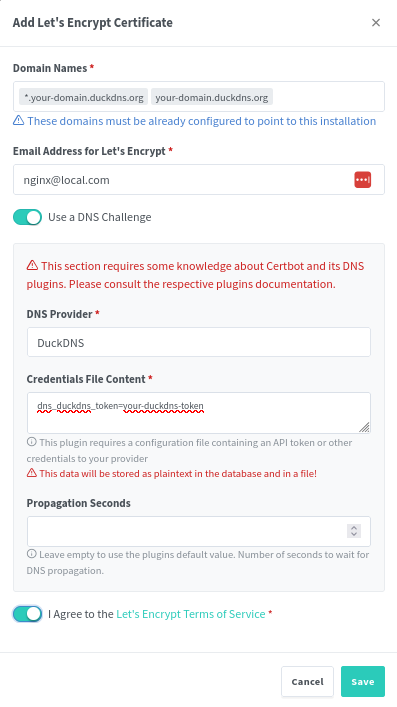

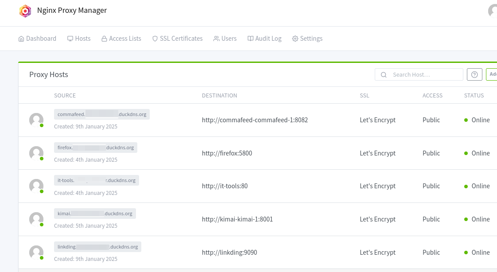

##### C. Services
###### 🤖 C.1 [Ollama](https://ollama.com/)
Finally, on my Proxmox node, I run some services directly. These services are not part of a VM or container and are deployed directly on the host. The reason for this is ease of use, and because they are not meant to be uninstalled from the system. A main example is the Ollama server, which I use to provide LLM support and experiment with them.

During my prompt experimentation, some modelfiles were created, which are available here: [https://github.com/CSpyridakis/modelfiles](https://github.com/CSpyridakis/modelfiles).

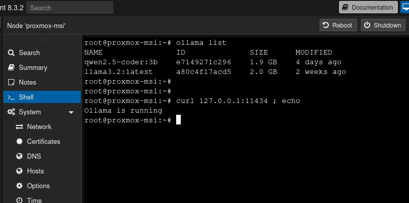

##### D. Kubernetes Cluster

For experimentation and learning, I used [Terraform](https://developer.hashicorp.com/terraform) (see [this](./proxmox/terraform/) directory) to provision Proxmox and create multiple virtual machines. 

These VMs are then configured using [Ansible](https://docs.ansible.com/) (see [this](./proxmox/ansible/) directory) to form a [Kubernetes](https://kubernetes.io/) cluster. To monitor the VMs, Ansible also sets up [Prometheus](https://prometheus.io/) and [Grafana](https://grafana.com/) to display metrics.

Prometheus by default has its own UI which is available by visiting `http://[IP-DOMAIN]:9090`.

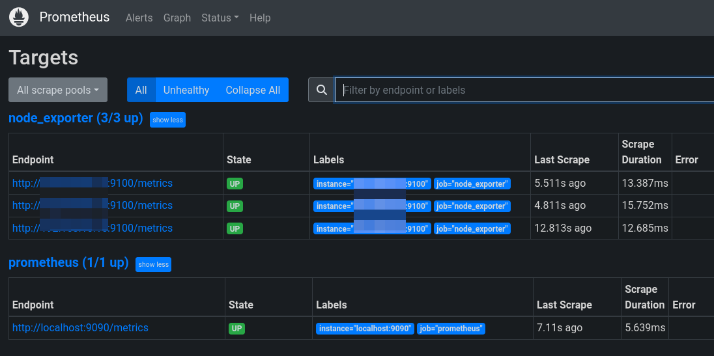

Since the extracted metrics may lack sufficient detail, Grafana can be used to gain deeper insights into the system. After deployment, visit `http://[IP-or-DOMAIN]:3000` to access the Grafana dashboard.

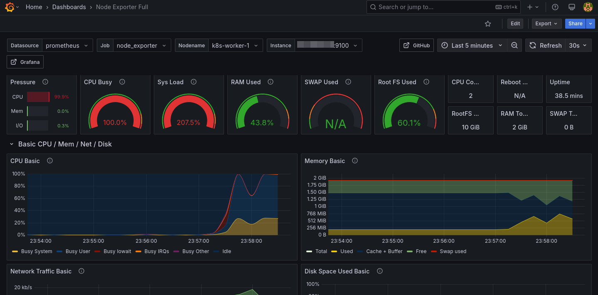

--- 

### 🖴 2. Network attached storage (NAS) 
As my main storage system, I have installed [TrueNAS Scale](https://www.truenas.com/) on an Intel NUC device. This way, I can access and store files from any device in my **Homelab** network, even from devices connected via VPN.

To differentiate the access for services and users, multiple datasets have been created with different privileges.

The NAS stores my files in a RAID configuration, providing redundancy in case of a failure of one of the storage disks.

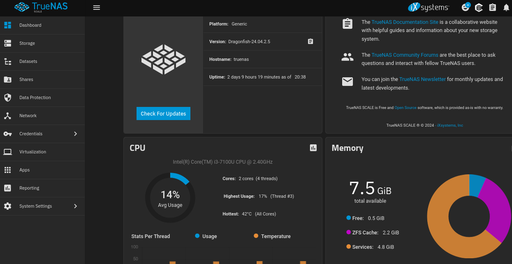

#### ⚙️ Services
Every service related to storage runs on this device.
First and foremost, there are services that handle my personal data, such as [Nextcloud](https://nextcloud.com/), [Jellyfin](https://jellyfin.org/), and [Photoprism](https://www.photoprism.app/) for my multimedia, etc.

Then, there are other services related to the storage of code, containers, and more - on my premises. For this reason, I use [Gitea](https://about.gitea.com/) and [Distribution](https://distribution.github.io/distribution/).

--- 

There are also some low-computation devices with limited capabilities that I use in my **Homelab**.

### 3. Intel NUC

I have an Intel NUC device, more specifically a `NUC10i3FNH`, which runs `x86` experiments that, for various reasons, are more convenient to run outside of a VM. Or on a device like this, which can behave as an edge node in a particular application. This device runs `Ubuntu Server`, and its main specs are listed below.

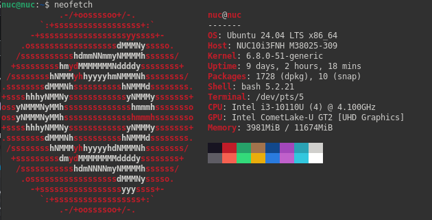

### 4. Raspberry PI
For experiments that need to run on an `ARM-based` system, a `Raspberry Pi` is also used in my Homelab. Similarly to the NUC device, it also runs `Ubuntu Server`.

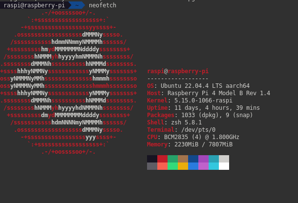

### 5. Jetson Nano

Finally, for applications that require an embedded Linux system equipped with a GPU, I also have a `Jetson Nano`, which serves as my first point of experimentation in this field.

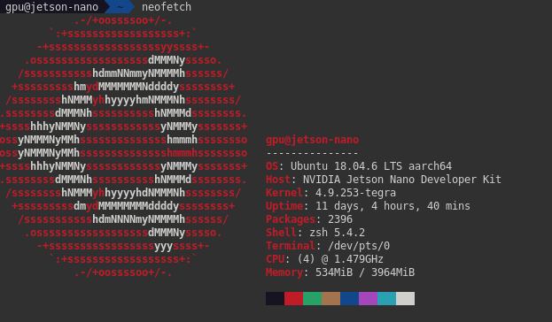

--- 

## Future goals
- Create an automated BU mechanism
- Migrate to immich
- Deploy Portainer stacks into the Kubernetes Cluster
- Increase the number of physical devices & Cluster Proxmox
- High Availability 

---

## ⚖️ Legal Notice

All product names, logos, brands, trademarks, and registered trademarks mentioned or displayed in this repository are the property of their respective owners. They are used here solely for identification and descriptive purposes, to name the technologies involved in this Homelab.

Their use does **not** imply any affiliation with, endorsement by, or sponsorship from the respective trademark holders. This project is not associated with any of these companies or organizations in any way. All rights are reserved by their respective owners.

The original content of this repository — including the configurations, documentation, code, and the particular way these technologies are integrated and used together — is the work of this project and is licensed under the [MIT License](./LICENSE). The trademarks themselves remain the property of their respective owners and are excluded from this license.
