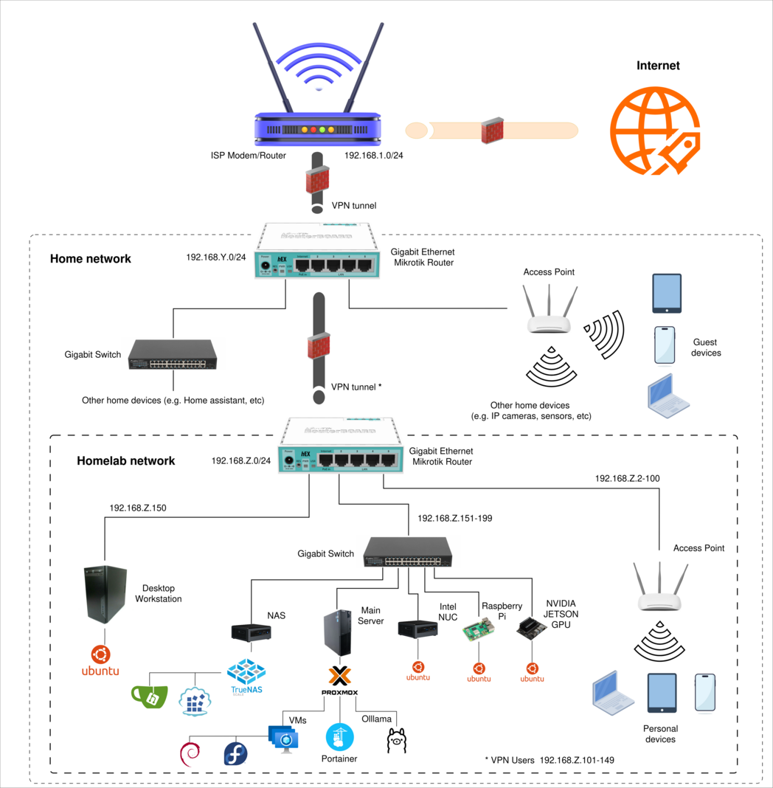

# Homelab

## General Notes
This repository serves as the primary documentation point for my **Homelab**.

The **Homelab** project is an on-premises infrastructure that accommodates the networks and devices I use for experimenting with new technologies or providing private area self-hosted services. This approach ensures that the data created is stored on proprietary devices, providing a safe testbed for learning, before applying similar principles in the field. 

In this repository: [https://github.com/CSpyridakis/notes](https://github.com/CSpyridakis/notes), you can find general notes on various technologies. Some of these notes are relevant to the creation and maintenance of this **Homelab**.

*TODO:* In the future, this repository will also include relevant configuration files.

For quick access and an at-a-glance overview of the **Homelab**'s status, I use the [homepage dashboard](https://github.com/gethomepage/homepage). You can find my configuration for this dashboard in the following repository: https://github.com/CSpyridakis/homepage.

Regarding my Desktop Workstation, which is one of the devices in this network, I use an Ubuntu Desktop system as my daily driver. My personal collection of dotfiles is also available here: [https://github.com/CSpyridakis/dotfiles](https://github.com/CSpyridakis/dotfiles).

---

## Network Diagram

---

## Router

## Internal network devices

### 1. Main Server
The role of my main server, at this point 

#### Proxmox
[Proxmox VE](https://www.proxmox.com/en/) is used as my [Τype 1](https://aws.amazon.com/compare/the-difference-between-type-1-and-type-2-hypervisors/) [Hypervisor](https://en.wikipedia.org/wiki/Hypervisor). 

##### A. Virtual Machines
Multiple VMs are created using Proxmox to run experiments that follow [IaaS]() printiples before continuing experiments in other infrastructus, either private or public. 

##### B. Portainer
The docker-compose files that have been used for some of the services, are available here: [https://github.com/CSpyridakis/dockerfiles](https://github.com/CSpyridakis/dockerfiles).

[Duck DNS](https://www.duckdns.org/) is used to create the with the help of [Let's encrypt](https://letsencrypt.org/) for the Certificates.

##### C. Services
###### C.1 [Ollama](https://ollama.com/)
Moreover, modelfiles are available here: [https://github.com/CSpyridakis/modelfiles](https://github.com/CSpyridakis/modelfiles).

--- 

### 2. NAS 
[TrueNAS]()

#### Services
Among others like ([Jellyfin](), [Photoprism](), [Nextcloud](https://nextcloud.com/), etc, which are used )

##### 1. [Gitea](https://about.gitea.com/)
##### 2. [Distribution](https://distribution.github.io/distribution/)
##### 3. [Pi-hole](https://pi-hole.net/)

--- 

### 3. Intel NUC

### 4. Raspberry PI

### 5. Jetson Nano

--- 
